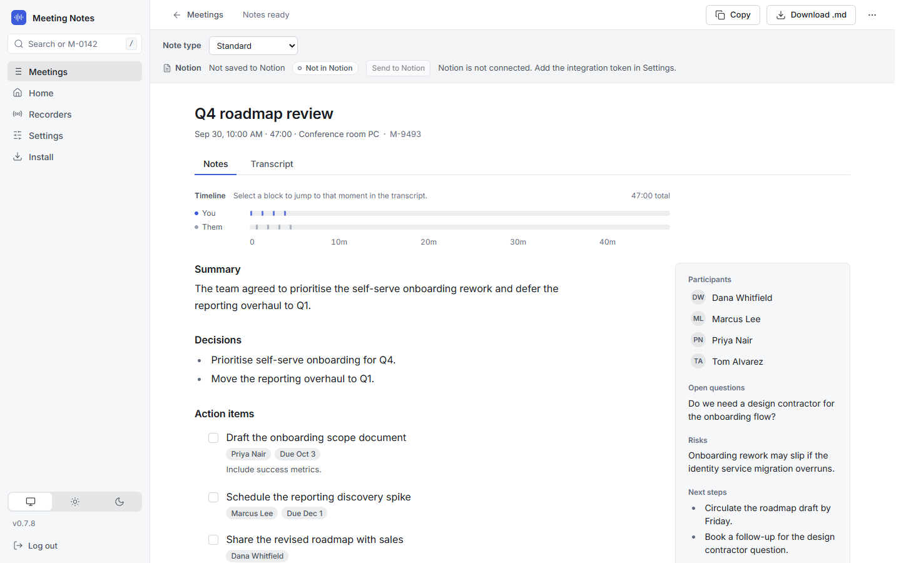
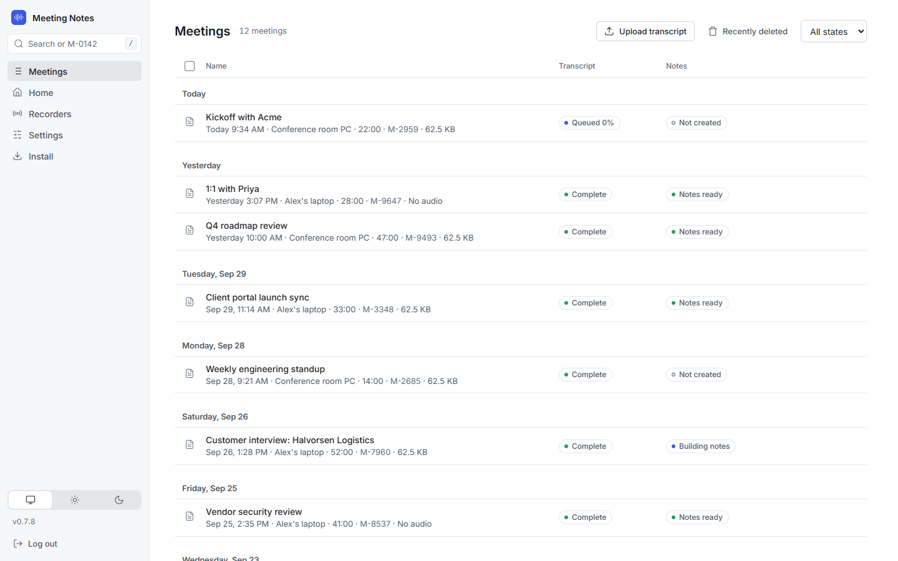
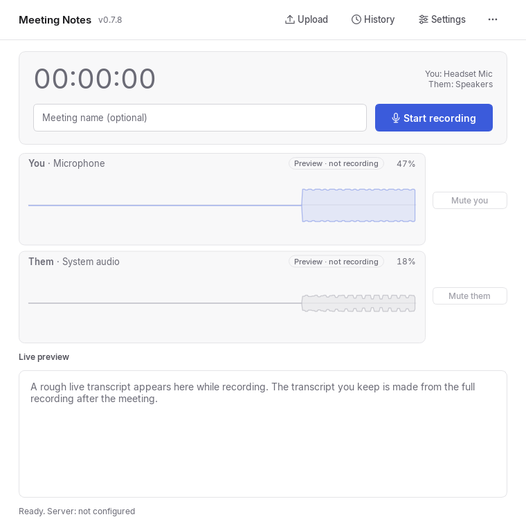
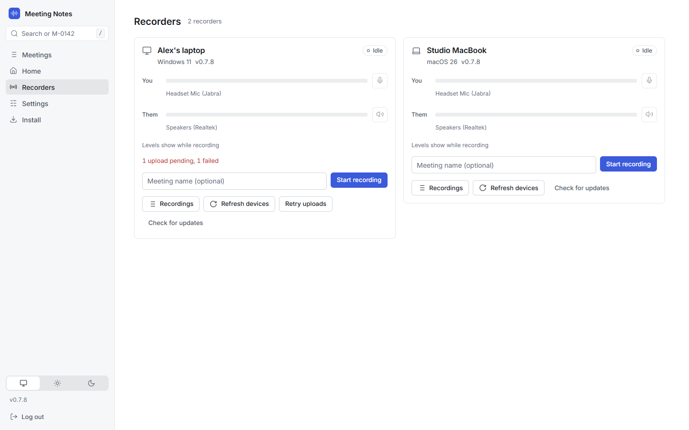

# Meeting Notes

Meeting Notes records your microphone and your meeting's audio as **two separate
tracks**, so "You" and "Them" in the transcript are exact, not guessed. A small
desktop app (Windows or macOS) does the recording. A server you run yourself
transcribes it with [faster-whisper](https://github.com/SYSTRAN/faster-whisper)
and writes AI meeting notes: summary, decisions, action items. Audio,
transcripts and notes stay on your server.

```text
[00:04:12] You:   Can we push the launch to the 30th?
[00:04:19] Them:  That works, I'll update the tracker.
```



| Meetings list | Desktop client |
|---|---|
|  |  |



_Screenshots use fictional demo data._

## Features

**Recording**
- Two tracks, no virtual audio driver and no admin rights: Windows loops back
  the output device (WASAPI); macOS 13+ uses ScreenCaptureKit.
- Notices Microsoft Teams, Zoom and Google Meet calls (Chrome, Brave, Edge) and
  offers to record them; suggests stopping when the call seems to be over
  (nothing stops without you, except a recording that was started from the
  call prompt with auto-stop on, or one started by the optional auto record
  setting, which ends on the hour, after 30 seconds of silence, or only by you,
  and can be set to manual for any recording with **Disable auto end**).
- Shows live input levels before you press Record, picks up headsets that are
  plugged in or removed mid-meeting, and keeps recording if a device drops.
- Records to disk first. If the server is down, the recording is queued and
  uploaded later.

**Transcription**
- Runs on your server with faster-whisper (CPU), with word-level timestamps.
- Upload an existing recording (WAV, MP3, M4A/MP4, FLAC, OGG/OGA, Opus, AAC,
  WebM) or a transcript you already have (`.txt`, `.vtt`, `.srt`, or pasted
  text) instead of recording.

**Notes**
- AI providers: **Claude** (through the Claude Code CLI and your Claude
  subscription), **Codex / ChatGPT** (Codex CLI and your ChatGPT subscription),
  or **Ollama** (a local model). Or turn AI off and keep just the transcript.
- Note types with editable prompts (built in: Standard, Quick notes, Detailed
  webinar; add your own). Regenerate with a different type at any time.
- Notes are Markdown; copy or download them as `.md`.

**Organisation**
- Meetings grouped by day, full-text search, bulk actions.
- Split a meeting in two (with suggested split points) or combine several.
- Deleted meetings go to "Recently deleted" and can be restored for 30 days.

**Integrations**
- Copy finished notes into Notion, one page per month and note type.
- REST API and an MCP server so AI agents can read your meetings, using
  per-agent API keys.

**Remote control**
- The Recorders page lists every open desktop client and can start, stop and
  mute recordings from a browser, including from a phone.

**Updates**
- The server hosts the client installers; the desktop app shows an "Update
  available" button. The server stays compatible with the current client and
  the five releases before it.

## How it works

```
 Desktop client (Windows / macOS)               Your server (Docker)
┌──────────────────────────────┐   live 16 kHz   ┌──────────────────────────────┐
│ mic ─┐                       │   preview       │ FastAPI web UI + API (:8000) │
│      ├─► recorder ───────────┼───websocket────►│  live preview (disposable)   │
│ sys ─┘      │                │                 │                              │
│             ▼                │   full upload   │  final transcription         │
│  tracks saved on disk ───────┼───HTTP─────────►│  (faster-whisper) ──► index  │
│  upload queue (retries)      │                 └──────┬───────────────────────┘
└──────────────────────────────┘                        │ review queue
                                                 ┌──────▼───────────┐   ┌──────────┐
 Browser ──► web UI (notes, search, settings)    │ bridge worker    │──►│ Claude / │
 AI agents ─► /api/v1 + /mcp (per-agent keys)    │ (optional)       │   │ Codex /  │
 Notion ◄── copies of finished notes             └──────────────────┘   │ Ollama   │
                                                                        └──────────┘
```

The client records to disk and streams a rough live preview, then uploads the
full recording when the meeting ends. The server transcribes each track
separately and merges them into one You/Them transcript. If AI notes are on, a
separate **bridge** container (it holds your AI provider logins and has no
published port) picks up the job, generates the notes and posts them back. The
server can then copy them to Notion, and agents can read everything over the
API. More detail in [docs/architecture.md](docs/architecture.md).

## Quick start

You need a machine to run the server (any computer with Docker, a few GB of
RAM and CPU to spare) and the desktop client on the computer you hold meetings
on. The examples use `192.168.1.50` as the server's address; use yours.

### 1. Server

```bash
git clone https://github.com/heyitsmiike101/Meeting-Notes.git
cd Meeting-Notes/docker
```

Create `docker/.env` (it is git-ignored). Pick a long random token; it is the
password for the web UI and for the desktop clients:

```bash
MEETING_NOTES_TOKEN=<your-token>
MEETING_NOTES_SERVER_ADDRESS=http://192.168.1.50:8000
TZ=America/New_York
```

```bash
docker compose -p meeting-notes up -d --build
```

Open `http://192.168.1.50:8000` and sign in with the token. The first
transcription downloads the Whisper model (`base.en`, about 145 MB) from
Hugging Face, so the server needs internet access once; after that it is
cached in a Docker volume.

Without `MEETING_NOTES_TOKEN` the server runs with no authentication and the
web UI shows a warning. Do not expose it to the internet either way; keep it on
your LAN or behind a VPN. `MEETING_NOTES_SERVER_ADDRESS` is the address
embedded in the client installers; if you leave it unset the server uses the
address the browser used.

### 2. AI notes (optional)

Notes need the **bridge** container, which is behind the `ai` profile and
requires `MEETING_NOTES_TOKEN`:

```bash
docker compose -p meeting-notes --profile ai up -d --build
```

Then open **Settings** in the web UI and choose a provider:

- **Claude (subscription):** click **Connect Claude**, open the sign-in link it
  shows, approve access and paste the code back into Settings. Uses your Claude
  Pro/Max limits, not API billing.
- **Codex / ChatGPT:** click **Connect ChatGPT** and complete the device sign-in.
- **Ollama (local):** enter the base URL of your Ollama server and load its
  models. The URL is opened from inside the bridge container, so use the
  machine's LAN address (`http://192.168.1.50:11434`), not `localhost`.

Logins live in Docker volumes (`meeting-notes-claude`, `meeting-notes-codex`),
so recreating the container does not sign you out. Do not put provider API keys
in `docker/.env`. Optionally turn on **Automatically build meeting notes for new
meetings**; otherwise press **Build Meeting Notes** on a meeting.

### 3. Desktop client

Prebuilt installers are not published, so you build the client once (see
[Development](#development)) and the server hands it out to your computers.

**Windows 10/11 (64-bit).** Put `MeetingNotes-Windows.zip` in the server's
`/data/client/` directory:

```bash
docker compose -p meeting-notes exec meeting-notes-server mkdir -p /data/client
docker compose -p meeting-notes cp MeetingNotes-Windows.zip meeting-notes-server:/data/client/
```

(If you set `MEETING_NOTES_DATA_MOUNT` to a host path, copy it into that
folder's `client/` subfolder instead.) Then on the Windows PC open the web UI's
**Install** page and follow it, or run in PowerShell:

```powershell
powershell.exe -NoProfile -ExecutionPolicy Bypass -Command "irm 'http://192.168.1.50:8000/install/client-agent.ps1' | iex"
```

It installs under `%LOCALAPPDATA%\MeetingNotes`, needs no admin rights and
creates Start Menu and desktop shortcuts.

**macOS 13+ (Apple silicon).** Build `MeetingNotes-macOS.zip` on a Mac with
`tools/build_macos.sh`, copy it to `/data/client/` the same way, then on any
Mac run:

```bash
curl -fsSL http://192.168.1.50:8000/install/mac.sh | bash
```

It installs `~/Applications/Meeting Notes.app` without a password. On first start
the app opens Settings so you can paste the server password, and a panel lists the
macOS permissions it needs (**Microphone**, **Screen & System Audio Recording**,
and **Local Network** on macOS 15+) with a button to the right System Settings
pane for each. After switching Screen & System Audio Recording on, press **Quit
and reopen** in the panel. (Meeting Notes only captures audio, never the
screen.)

**Run from source instead.** On any machine with Python:
`pip install -e ".[client]"` then `meeting-notes-ui`.

**Connect it.** In the client open **Settings → Server**, enter the server URL
(`http://192.168.1.50:8000`) and the server password, and press **Test connection**.

## Using it

**Record.** Type an optional name and press **Start recording**; press **Stop
recording** when done. When Teams, Zoom or Meet starts using your microphone, a
small card in the corner offers to record it under the call's name (or, with
**Start recording automatically when a call starts** in Settings, just records it). **Mute you**
and **Mute them** silence one side without stopping the recording. When you
stop, the recording uploads automatically (queued if the server is offline).

**What happens next.** The server transcribes the upload, shows progress in
the Meetings list, and, if automatic notes are on, builds the notes. Open a
meeting to read the notes first; the Transcript tab is one click away, with a
You/Them timeline. Click the title to rename it.

**Note types.** Each meeting has a **Note type** select. Edit the prompts or add
your own in **Settings**, and choose the **Default note type** used for
automatic notes. Changing the type on a finished meeting offers **Regenerate**.
The desktop client has a **Default note type** in its own Settings and a
**Note type** select beside the meeting name: a meeting recorded there gets notes
of that type automatically, saved where that type sends them (for example its
Notion page), even when the server's automatic notes are off. The Recorders page
has the same select.

**Add a meeting without recording.** Use **Add a meeting** on Home, or **Upload**
in the desktop client or **Upload transcript** on the Meetings page: audio gets
transcribed, a transcript file or pasted text (a Teams or Zoom transcript, for
example) is used as is.

**Split, combine, delete.** Use a meeting's `...` menu to **Split meeting...**
or **Combine with another meeting...**, or tick several rows to combine them.
Deleting moves a meeting to **Recently deleted**; restore it within 30 days.
**Delete audio** is separate and permanent.

**Copy notes to Notion.**
1. Create an internal integration at notion.so/profile/integrations and copy its
   token.
2. Paste the token under **Notion** in Settings (or set `NOTION_TOKEN`).
3. In Notion, open the parent page you want, then `...` → **Connections** and
   add the integration.
4. In Settings → Note types, set that page as **Save to Notion** for each note type, and
   optionally enable **Copy notes to Notion automatically** for that type.

The server keeps one page per month and note type under the parent
(`<Month>-<YYYY> <note type>`), with one toggle per meeting, newest first. Set
`TZ` so the month is in your time zone. A meeting's **Send to Notion** button
sends it by hand.

**AI agents (REST and MCP).** In **Settings → AI access** create an agent key
(shown once, read-only unless you allow writes). Agents never get your web token,
and keys can never delete anything. Add it to Claude Code with:

```bash
claude mcp add --transport http meeting-notes http://192.168.1.50:8000/mcp \
  --header "Authorization: Bearer <your-agent-key>"
```

Other MCP clients that take an HTTP server entry use the same URL and header,
for example:

```json
{ "mcpServers": { "meeting-notes": {
    "type": "http",
    "url": "http://192.168.1.50:8000/mcp",
    "headers": { "Authorization": "Bearer <your-agent-key>" } } } }
```

The REST API lives under `/api/v1/` with the same header; discovery pages that
need no key are `/api/v1/manifest`, `/llms.txt` and `/api-docs.md`.

**Remote control.** Open **Recorders** in the web UI to see each open client's
levels and state and to start, stop, rename, mute or update it, pick its note
type or turn off an automatic end. Each client has
**Allow control from the server** in its Settings (on by default). Only a web
login can control clients; agent keys cannot.

## Configuration

Put these in `docker/.env`. Everything else (transcription model, retention,
AI provider, note types, appearance) is set in the web UI under **Settings**.

| Variable | Default | Purpose |
|---|---|---|
| `MEETING_NOTES_TOKEN` | none (open!) | Password for the web UI and clients. Required for the AI bridge. |
| `MEETING_NOTES_SERVER_ADDRESS` | request address | Address embedded in client installers, e.g. `http://192.168.1.50:8000`. |
| `TZ` | UTC | Time zone for Notion month pages, e.g. `America/New_York`. |
| `MEETING_NOTES_MODEL` | `base.en` | Initial Whisper model. Settings wins once saved; other choices: `small.en`, `large-v3-turbo`. |
| `NOTION_TOKEN` | none | Notion integration token (overrides the one in Settings). |
| `MEETING_NOTES_DATA_MOUNT` | Docker volume | Host path for app data (`/data`). |
| `MEETING_NOTES_MEDIA_MOUNT` | Docker volume | Host path for recordings (`/media`). |
| `MEETING_NOTES_MODELS_MOUNT` | Docker volume | Host path for downloaded models (`/models`). |
| `MEETING_NOTES_MAX_UPLOAD_BYTES` | 8 GiB | Upload size limit. Not in the compose file; add it to `environment:` to use it. |
| `INSTALL_DIARIZATION`, `MEETING_NOTES_DIARIZATION`, `HUGGINGFACE_TOKEN` | off | Experimental remote-speaker labelling; its settings are currently hidden. |

The server listens on port 8000; the bridge has no published port.

**Data and backups.** `/data` holds settings, meeting metadata and transcripts,
jobs, notes, the search index, agent keys, Notion state, Recently deleted and the
client installers (`client/`). `/media` holds the audio. Back up both; the
models volume can be re-downloaded. The bridge's `meeting-notes-claude` and
`meeting-notes-codex` volumes only hold provider logins. The server keeps
audio forever by default; **Settings** can delete it after N days.

More options and the full web UI walkthrough are in
[docs/reference.md](docs/reference.md).

## Development

Python 3.10+ is recommended (3.9 is the floor; the MCP server needs 3.10+).

```bash
python -m venv .venv
.venv/bin/pip install -e ".[server,client,dev]"   # Windows: .venv\Scripts\pip
python -m pytest -q
```

Extras: `client` (desktop app, no ML dependencies), `server` (web server,
faster-whisper, MCP), `whisper` (faster-whisper only, for the command-line
tools), `bridge`, `diarization`, `dev` (pytest), `build` (Nuitka). The tests
need no audio hardware or model downloads. The client-compatibility contract
tests live in `tests/compat/` (see its README); every release adds a frozen
copy of that client's network code there.

Run the server without Docker: `uvicorn meeting_notes.server.app:app --port 8000`
(set `MEETING_NOTES_DATA` and `MEETING_NOTES_TOKEN`).

**Build the Windows client** (Python 3.13, on Windows):

```powershell
python -m pip install -e ".[client,build]"
python -m nuitka --standalone --windows-console-mode=disable `
  --enable-plugin=pyside6 --include-package=meeting_notes `
  --include-package=soundcard --include-package-data=meeting_notes `
  --include-package-data=soundcard --windows-icon-from-ico=assets/meeting-notes.ico `
  --output-dir=dist --output-filename=MeetingNotes.exe `
  --assume-yes-for-downloads windows_client.py
Move-Item dist\windows_client.dist dist\MeetingNotes
(Start-Process dist\MeetingNotes\MeetingNotes.exe -ArgumentList "--smoke-test" -Wait -PassThru).ExitCode   # expect 0
Compress-Archive -Path dist\MeetingNotes\* -DestinationPath MeetingNotes-Windows.zip
```

**Build the macOS client** on an Apple silicon Mac with Xcode Command Line Tools:
`tools/build_macos.sh` (user-space only, no sudo). It produces
`MeetingNotes-macOS.zip`.

`tools/build_windows.ps1` runs the Windows steps above locally (build venv,
smoke test, zip). Nothing in the build talks to GitHub: there is no CI and no
GitHub release; the zip is published by copying it to the server. Other docs: [reference](docs/reference.md),
[architecture](docs/architecture.md), [manual testing](docs/manual-testing.md),
[feature checklist](docs/feature-checklist.md), [product](docs/product.md),
[design system](docs/design.md), [changelog](CHANGELOG.md).

## Privacy and legal

**Recording other people.** Recording a conversation without telling the other
participants is illegal in many places, including every two-party-consent
jurisdiction. Tell people they are being recorded. This tool captures only your
own machine's audio and does nothing to hide itself.

**Your data.** Audio, transcripts and notes are stored on your server only. The
desktop app talks only to that server. What can leave it: the transcript sent to
the AI provider you pick (Claude, ChatGPT, or none if you use Ollama), the
notes copied to Notion if you enable it, and the one-time Whisper model download
from Hugging Face.

## License

MIT. See [LICENSE](LICENSE).
